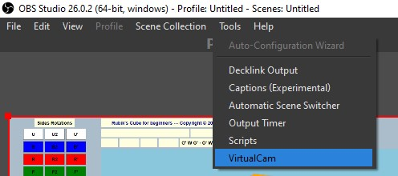
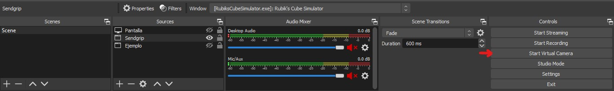

# rubick_CVS_ColorDetector

This program read a virtual cube and returns the colors of each cell

## Software needed

This program needs a virtual camera that cast the content of the program used to simulate the rubiks cube.
In order to generate it, you need to have installed the followign softwares/packages

* OBS to install click [here](https://obsproject.com/)
* OBS virtual camera plugin installation files [here](https://github.com/Fenrirthviti/obs-virtual-cam/releases)

Once the package are installed please follow the instructions showed below:

1. Open OBS
1. On OBS tool bar select Tools
1. Select Virtual Camera 
1. Click on start
1. Search for the button Start Virtual camera
1. Click on Start Virtual Camera 

## Python libraries needed
